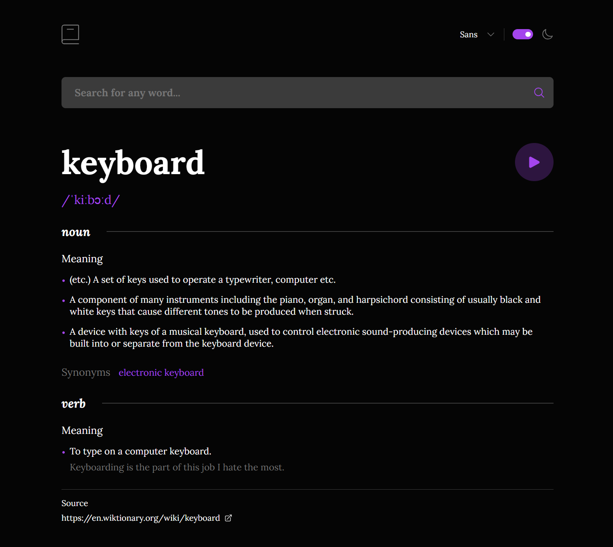

# PhraseFox - Modern Dictionary Web App

PhraseFox is a feature-rich dictionary web application that offers a seamless word exploration experience with multiple themes, fonts, and comprehensive word information.



## 🌐 Live Demo

[View Live Demo](https://phrase-fox-alpha.vercel.app/)

## ✨ Features

- **Word Search & Definitions**

  - Comprehensive word definitions
  - Multiple meanings and usage examples
  - Part of speech categorization
  - Clickable synonyms and antonyms for quick search

- **Audio & Phonetics**

  - Word pronunciation audio playback
  - Phonetic transcriptions
  - Play/pause audio controls

- **Theme Customization**

  - Dark/Light mode toggle
  - Three font family options:
    - Sans-serif (Inter)
    - Serif (Lora)
    - Monospace (Inconsolata)
  - Local storage for user preferences

- **Error Handling**
  - Graceful error messages
  - No-result handling
  - Network error management
  - Loading states

## 🛠️ Tech Stack

- **Framework:** React 18
- **Build Tool:** Vite
- **State Management:** React Context API
- **Styling:** Pure CSS with CSS Modules
- **API:** Free Dictionary API
- **Deployment:** Vercel

## 💅 Styling Approach

- CSS Variables for theme colors and typography
- Mobile-first responsive design
- CSS Grid and Flexbox for layouts
- CSS Modules for component-scoped styling
- Smooth transitions and animations

## ♿ Accessibility Features

- ARIA labels for interactive elements
- Semantic HTML structure
- Keyboard navigation support
- Screen reader friendly content
- Color contrast compliance
- Focus management
- Skip links
- Proper heading hierarchy

## 📱 Responsive Design

- Mobile-first approach
- Fluid typography
- Responsive layouts
- Adaptive UI elements
- Touch-friendly interactions
- Cross-browser compatibility

## 🚀 Getting Started

1. Clone the repository:

   ```bash
   git clone https://github.com/KeepSerene/dictionary-web-app-react.git
   ```

2. Install dependencies:

   ```bash
   npm install
   ```

3. Run development server:

   ```bash
   npm run dev
   ```

4. Build for production:
   ```bash
   npm run build
   ```

## 🧰 Project Structure

```
src/
├── components/
│   ├── AppContent/
│   ├── Error/
│   ├── Header/
│   ├── SearchForm/
│   ├── SearchResult/
│   └── WelcomeNote/
├── utils/
├── App.jsx
└── main.jsx
```

## 👤 Author

**Dhrubajyoti Bhattacharjee**

- Portfolio: [MathToDev](https://math-to-dev.vercel.app/)
- GitHub: [@KeepSerene](https://github.com/KeepSerene)
- LinkedIn: [Dhrubajyoti Bhattacharjee](https://www.linkedin.com/in/dhrubajyoti-bhattacharjee-320822318/)

## 📄 License

This project is licensed under the MIT License - see the [LICENSE](LICENSE) file for details.

## 🙏 Acknowledgments

- [Free Dictionary API](https://dictionaryapi.dev/) for the dictionary data
- [Google Fonts](https://fonts.google.com/) for the typography
- [Heroicons](https://heroicons.com/) for the icons

## 💡 Future Improvements

- Add word of the day feature
- Implement word history
- Add multiple language support
- Include more pronunciation options
- Add word etymology information
- Implement word bookmarking

---

Feel free to star ⭐ this repository if you find it helpful!
